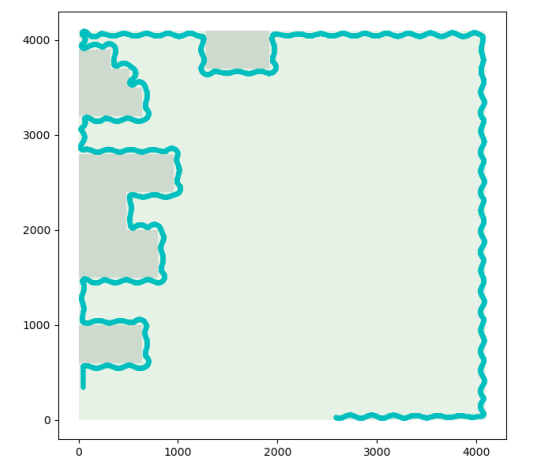

# 
 MSP432 Automatic Wayfinding Vehicle

An automatic wayfinding vehicle developed using MSP432P401

## Table of Contents

- [ MSP432 Automatic Wayfinding Vehicle](#-msp432-automatic-wayfinding-vehicle)
  - [Table of Contents](#table-of-contents)
  - [Requirements](#requirements)
  - [Install](#install)
  - [Usage](#usage)
    - [Compile and run](#compile-and-run)
    - [Emulator](#emulator)
  - [Hardware](#hardware)
  - [Testing](#testing)
  - [Documentation](#documentation)
  - [Issues](#issues)
  - [License](#license)

## Requirements

- Development tools:

  - [**Code Composer Studio IDE**](https://www.ti.com/tool/CCSTUDIO).

- Hardware:

  - **MSP432P401**: Development board, test board.
  - **BoostXL Edu MKII**: Vehicle development board.
  - **Bioloid AX-12**: Dynamixel.
  - **Bioloid AX-S1**: Sensor Module.

Any hardware needed can be purchased online.

## Install

Clone to local directory:

`$ git clone https://github.com/junjielyu13/MSP432-Automatic-wayfinding-vehicle.git`

## Usage

### Compile and run

1. Open the [project](./ProjectCode/) with Code Composer Studio.

2. Compile and Run.

### Emulator

More information and tutorial on [here](./Emulator/README.md).

## Hardware

- **MSP432P401**:

- **BoostXL Edu MKII**:

- **Bioloid AX-12**:

- **Bioloid AX-S1**:

## Testing

For testing, you can mount the machine for testing:

Or use the emulator to test:

## Documentation

More documentation about **MSP432**, **BoostXL Edu MKII**, **AX-12**, **AX-S1** [here](./doc/).

Documentation about **Emulator** [here](./Emulator/README.md).

## Issues

More issues, or other problems, please send them [here](https://github.com/junjielyu13/MSP432-Automatic-wayfinding-vehicle/issues).

## License

[MIT](https://github.com/junjielyu13/MSP432-Automatic-wayfinding-vehicle/blob/main/LICENSE), [@All Contributors](#contributing).
